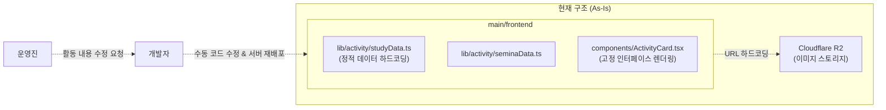

# 02. Activity 동적 구성 기능 도입 (Activity CMS)

> **📜 문서 수정 이력 (Changelog)**
> **[2026-03-23 수정 사항]**
> - **Orphaned Image (미사용 이미지) 방지 정책 추가:** 게시물 작성 중도 취소 시 클라이언트 측 즉각적인 클라우드 스토리지 비우기 및 주기적 잉여 이미지 일괄 제거(Cron) 정책 (5.1.2 항목) 반영
>
> **[2026-03-22 수정 사항]**
> - **용어 및 계층 구조 명확화:** `Type(종류)` > `Field(속성)` > `Item(콘텐츠)` 3단계 구조로 용어 통일
> - **속성명 변경:** 렌더링용 입력 양식임을 명확히 하기 위해 `Field`항목에 들어 있던 `type`을 `inputType`으로 변경
> - **불변 식별자(Immutable Identifier) 도입:** 값이 변경될 소지가 있는 `name` 대신, 식별 고유 키값인 `typeId`, `fieldId`를 사용하도록 변경
> - **시스템 아키텍처 명시:** 백오피스와 메인 웹 서버가 서로 API(구독) 통신하는 방식이 아닌, 동일한 MongoDB를 각각 직접 조회하는 Shared DB(Direct Connection) 구조 채택 및 역할 명시 (3.3 및 3.4 항목 도입)

## 1. 개요 및 목적
기존 메인 웹의 Activity 영역(스터디, 세미나, 개발 등) 데이터는 프론트엔드 코드(`studyData.ts` 등) 내에 **하드코딩**되어 관리되고 있습니다. 이로 인해 새로운 활동이 추가되거나 속성(필드)이 변경될 때마다 개발자가 직접 코드를 수정하고 서버를 재배포해야 하는 비효율이 발생합니다.

본 기능 명세는 백오피스에서 Activity의 **유형(Type)** 과 **속성(Field)**, 그리고 실제 들어갈 **콘텐츠(Item)** 를 운영진이 직접 정의하고 관리할 수 있는 **동적 CMS(Content Management System)**를 구축하여 운영 효율성(UX)과 시스템 확장성(DX)을 극대화하는 것을 목표로 합니다.

---

## 2. 현재 상태 분석 (As-Is)

### 2.1 문제점
현재 웹사이트의 메인 화면에 출력되는 Activity(스터디, 세미나, 개발 등) 데이터는 프론트엔드 소스 코드 내에 완전히 하드코딩되어 있습니다.

- `main/frontend/src/lib/activity/studyData.ts` 등 — 각 활동별 데이터(주제, 상세내용, 기간, 툴 등)가 정적 배열로 고정되어 있음.
- 기술 스택 아이콘(`tools`) 마저 URL 검증을 개발자가 주석으로 남기며 수동으로 체크해야 하는 비효율성 존재.
- 새로운 속성(예: 세미나의 '발표자' 필드)이 필요할 때마다 고정된 인터페이스(`ActivityItem`)를 개발자가 직접 수정하고 배포해야 함.
- 이미지 자원의 URL(`https://pub-...r2.dev/*.jpeg` 등)이 코드상에 문자열로 직접 적혀 있어, 파일이 수정될 때마다 코드 수정 및 재배포가 강제됨.

### 2.2 구체적 고정 항목들 (`studyData.ts` 기준)

| 영역 | 고정된 내용 |
|------|------------|
| 인터페이스 구조 | `topic`, `details`, `date`, `images`, `tools`, `link` 등으로 필드 형태가 제한됨 |
| 이미지 배열 | Cloudflare R2 스토리지의 URL 문자열들이 개별 `items` 속성에 정적으로 들어가 있음 |
| 노출 순서 | 소스 코드 상의 배열(`studyItems`) 선언 순서에 강제적으로 의존하게 됨 |

> **결론:** 아주 단순한 오타 제보나, 새로운 학기의 신규 활동 추가 시에도 운영진이 직접 할 수 없고 무조건 프론트엔드 개발자가 코드를 수정 및 재배포해야 운영에 반영됩니다.

### 2.3 현재 시스템 결합 구조

이 기능의 가장 큰 목적은, 기존의 '프론트엔드 코드 내부 종속식 렌더링'을 '백오피스 DB 변경 즉시 동적 렌더링'으로 아키텍처를 뒤집는 것에 있습니다.



- 현재 구조에서는 데이터의 주인이 코드를 작성한 개발자에게 종속되어, 콘텐츠가 유연하게 관리되지 못하는 가장 큰 병목이 발생합니다.

---

## 3. 핵심 아키텍처 및 해결 방안 (To-Be)

우리가 만들 CMS는 **"구글 폼을 만드는 관리자 화면"** 과 완벽하게 동일한 원리로 동작합니다.

### 3.1. 문제 해결 매핑 (As-Is ➡️ To-Be)
2장에서 정의한 문제점들을 아래와 같은 기술적 전략으로 일대일(1:1) 매칭하여 해결합니다.

| As-Is (해결할 문제점) | To-Be (기술적 해결 전략) | 관련 목차 |
| --- | --- | --- |
| **하드코딩으로 인한 개발자 종속성 및 확장성 한계**<br>(고정된 데이터 구조 & 잦은 재배포) | **데이터베이스(MongoDB) 기반 조회 및 Schema-driven UI 도입**<br>하드코딩 데이터를 DB로 완전 이관(Type/Field/Item 분리)하여, **프론트엔드 코드 수정 및 재배포 없이** 백오피스에서 즉시 메인 웹 화면(신규 필드 포함)을 유연하게 제어. | 3.3, 4, 5.2 |
| **이미지 관리의 비효율성**<br>(코드 의존적 리소스 관리) | **Presigned URL 기반 다이렉트 클라우드 업로드**<br>스토리지 이미지와 DB URL 저장을 결합하여 프론트엔드 코드 배포와 파일 관리를 완전히 분리 | 5.1 |

### 3.2. 주요 용어 사전 (Glossary)
처음 CMS 구조를 접하는 팀원들을 위해, 본 문서와 개발 과정에서 가장 자주 쓰일 핵심 용어들을 정리합니다.

- **Type (활동의 종류) / `ActivityTypes` 컬렉션:** 
  - '스터디', '세미나', '해커톤' 등 메인 웹에서 하나의 **메뉴(탭)** 단위가 되는 큼직한 껍데기를 의미합니다. 
  - 백오피스에서 "새로운 활동 탭을 하나 만들자!"라고 할 때 이 Type을 하나 생성하게 됩니다.
- **Field / `ActivityField`(질문 문항 / 설계도):** 
  - 특정 ActivityType 안에서 데이터를 받기 위해 뚫어놓은 **입력칸(항목)** 들입니다. 
  - 예시: 스터디 Type 내부의 '기간(Date)', '상세설명(LongText)', '사진(Image)' 필드들.
  - 이 필드들이 모여서 하나의 "ActivityType(Schema 설계도)"을 이룹니다.
- **Item (실제 게시물 알맹이) / `ActivityItems` 컬렉션:** 
  - 운영진이 만들어진 Field 양식에 맞춰 빈칸에 실제로 타이핑해서 넣은 **진짜 데이터(글, 사진)**입니다.
  - 메인 웹에 예쁘게 그려지는 실제 활동들이 Item입니다.
- **하드코딩 (Hardcoding):**
  - 데이터를 관리자 웹이나 DB에서 가져오지 않고, 개발자가 소스 코드 파일(예: `.ts`, `.json`) 안에 직접 텍스트로 박아 넣는 행위. 우리가 이 프로젝트에서 **없애려는 가장 큰 문제점(As-Is)**입니다.
- **Schema-driven UI 패러다임:**
  - 프론트엔드가 화면을 그릴 때 코드에 하드코딩된 값(예: `item.topic`)을 찾는 것이 아니라, 백엔드가 주는 설계도(Schema) 문서만 쳐다보고 거기에 있는 필드를 꺼내서 화면을 자동으로 찍어내는(Dynamic Render) 최신 프론트엔드 설계 기법입니다.
- **Presigned URL (사전 발급된 URL):**
  - 무거운 이미지나 파일을 사용자가 업로드할 때, 우리 백엔드 서버를 거치지 않게 하기 위해 **클라우드(AWS S3, Cloudflare R2 등)에서 발급받는 "일회용 클라우드 출입증 티켓"**입니다. 이 티켓을 쓰면 프론트엔드에서 클라우드로 파일을 직행시킬 수 있어 서버 부하가 줄어듭니다.

### 3.3. 역할 분담 

#### 백오피스: "설계도를 만들고 데이터를 채우는 곳"
- **Backoffice Frontend (기획 UX)** 
  - 운영진이 마우스 조작만으로 `Type`과 `Field`를 동적으로 추가/삭제하는 **컨트롤 타워** 역할을 합니다.
  - 드래그 앤 드롭 기능을 지원해, 노출할 필드나 실제 카드(`Item`)의 '순서(order)'를 직관적으로 조작합니다.
- **Backoffice Backend (저장소 관리)**
  - 운영 관리자로서의 권한을 깐깐하게 검증(Auth)합니다.
  - 프론트엔드에서 조합된 자유로운 구조(Schema)의 양식과 실제 데이터(JSON)를 받아, MongoDB의 특성을 살려 에러 없이 유연하게 영구 저장(C/U/D)합니다.

#### 메인 웹: "전달받은 설계도대로 렌더링"
- **Main Backend (단순 정보 배달부)**
  - 메인 접속자들에 대한 복잡한 시스템 로직을 줄이고, MongoDB에 저장된 '설계도와 내용물(Item)'을 꺼내어 화면 쪽에 안전하고 빠르게 **단순 전달(Read)** 해주는 역할을 합니다.
- **Main Frontend (코어 렌더러)**
  - 서버로부터 넘어온 `Type`, `Field`, `Item` 구조를 해석합니다.
  - 사전에 정의된 규칙에 따라, **프론트엔드 소스 코드를 단 한 줄도 수정(재배포)하지 않고도** 그 안에 정의된 `Item(콘텐츠)`의 내용들을 알아서 예쁘게 화면에 그려냅니다(Dynamic Rendering).

### 3.4. 시스템 간 DB 연결 구조 (Shared Database)
서비스 간 의존도를 낮추고 운영 인프라를 단순화하기 위해, **백오피스와 메인 시스템이 서로 API로 통신하지 않고 동일한 MongoDB를 각각 직접 연결(Direct Connection)하여 조회하는 구조**를 채택합니다.
- **단일 장애점(SPOF) 방지 및 의존성 분리:** 백오피스 백엔드가 API를 제공하고 메인 백엔드가 이를 호출(Fetch)하는 구독 형태를 피합니다. 이를 통해 백오피스 서버가 다운되거나 점검 중일 때도 메인 웹사이트의 고객 조회 트래픽에는 전혀 영향을 주지 않도록 격리합니다.
- **직접 연결(Direct Connection):** 기존 퀴푸 아키텍처와 동일하게 `Backoffice Backend`와 `Main Backend`는 각각 독립적인 서버로 동작하며, 공통된 하나의 MongoDB 클러스터에 접속하여 각자의 역할(백오피스는 C/U/D 위주, 메인은 R 위주)에 맞게 쿼리합니다.

---

## 4. 데이터베이스 및 스키마 설계 (MongoDB)

RDBMS처럼 고정된 열(Column)을 가지는 대신, 동적으로 변하는 데이터를 담기 위해 유연한 Document 구조(NoSQL)를 채택합니다.
두 가지의 핵심 컬렉션(`ActivityTypes`, `ActivityItems`)으로 구성되며, 이에 대한 명확한 TypeScript 인터페이스 명세는 다음과 같습니다.

### 4.1. `ActivityTypes` 컬렉션 (양식 설계도 박스)

ActivityType은 어떤 활동(Type)이 있고, 그 활동은 어떤 항목(Field)를 필요로 하는지 정의합니다.

```typescript
// [공통 타입] 메인/백오피스, 프론트엔드 및 백엔드 등 모든 영역에서 공통으로 사용되는 타입
// 지원하는 입력 필드 타입 종류
type FieldType = 
  | "shortText"   // 단답형 텍스트 (예: 주제, 멘토 이름)
  | "longText"    // 서술형 텍스트 (예: 상세 설명)
  | "date"        // 단일 날짜
  | "dateRange"   // 기간 (시작일 - 종료일)
  | "image"       // 단일 이미지 업로드
  | "imageList"   // 다중 이미지 업로드
  | "url"         // 외부 링크 (예: Github, 퀴푸 메인웹 링크 등)
  | "icon";       // 기술 스택 아이콘 (예: Devicon 키워드)

// 개별 필드(질문 문항) 설계도
interface ActivityField {
  fieldId: string;         // 데이터를 넣고 뺄 고유 영문 키 (예: "topic", "details"), 수정 불가
  label: string;        // 백오피스 입력 폼에 보여질 한글 라벨 (예: "주제", "상세 설명")
  inputType: FieldType;      // 입력 필드의 형태 (프론트엔드 렌더링 기준)
  required: boolean;    // 필수 입력 여부
  order: number;        // 백오피스 입력 폼에서의 출력 순서
  
  // type이 "image" 또는 "imageList"일 경우의 추가 설정
  fileConfig?: {
    maxFiles?: number;  // 최대 허용 이미지 개수
    maxSizeMB?: number; // 장당 최대 용량 제한 (예: 5MB)
  };
}

// [백엔드/공통 타입] DB 모델 스키마의 기준이자, 프론트엔드가 응답받게 되는 타입
// 하나의 Type(스터디, 세미나 등)에 대한 전체 정의
interface ActivityType {
  _id: ObjectId;
  typeId: string;             // (예: "study", "semina") 수정 불가
  displayName: string;         // 메인 웹 네비게이션에 노출될 이름 (예: "스터디")
  description?: string;        // 활동에 대한 전반적인 설명
  order: number;               // 메인 웹 탭 메뉴에서의 노출 순서 (DnD 정렬용)
  isActive: boolean;           // 메인 노출 여부 토글 (비활성화 시 숨김)
  fields: ActivityField[];     // 💡 이 활동에서 입력받을 필드 항목들의 배열 (Schema 설계도)
  createdAt: Date;
  updatedAt: Date;
}
```

<details>
<summary><b>실제 MongoDB 저장 예시 (JSON 데이터)</b></summary>

```json
{
  "_id": "ObjectId",            // 몽고DB 자동 생성 id
  "typeId": "study",           // 스터디 고유 키값, 수정 불가
  "displayName": "스터디",       // 메인 웹 네비게이션에 노출될 이름
  "description": "개발 공부부터 코딩 테스트까지 등등...",
  "order": 1,                   // 👈 메인 웹 네비게이션 메뉴 노출 순서
  "isActive": true,             // 메인 노출 여부 토글
  "fields": [                   // 💡 어떤 입력 항목(질문)을 받을 것인가?
    { 
      "fieldId": "topic",          // 나중에 실제 값을 꺼낼 키
      "label": "주제",          // 백오피스 폼에 보일 질문 이름
      "inputType": "shortText",      // 입력 타입 (Text, Date, Image 등 프론트엔드 렌더링 기준)
      "required": true,
      "order": 1                // 👈 백오피스 입력 폼에서의 위치
    },
    { "fieldId": "date", "label": "기간", "inputType": "dateRange", "required": true, "order": 2 },
    // ... 세미나 타입이라면 여기에 "fieldId": "speaker" (발표자) 필드가 동적으로 들어감.
  ]
}
```
</details>

### 4.2. `ActivityItems` 컬렉션 (실제 데이터 창고)

Type 설계도에 맞춰 운영진이 직접 작성한 실제 게시물이 저장됩니다. 필드 값은 설계도의 불변 식별자인 `fieldId`를 키로 하는 유연한 구조(`Record<string, any>`)를 가집니다.

```typescript
// [백엔드/공통 타입] DB 모델 스키마의 기준이자, 프론트엔드가 응답받게 되는 실제 데이터 타입
interface ActivityItem {
  _id: ObjectId;
  typeKey: string;             // 부모격인 ActivityType의 typeId 참조값 (예: "study", "semina")
  order: number;               // 👈 동일 Type 내에서 리스트 노출 순서 (DnD 정렬용)
  isVisible: boolean;          // 승인/공개 여부 (임시저장 기능 등에 활용)
  
  // 💡 설계도(fields)의 규칙에 맞춰 자유롭게 들어가는 실제 데이터
  data: Record<string, any>;   

  createdAt: Date;
  updatedAt: Date;
}
```

<details>
<summary><b>실제 MongoDB 저장 예시 (JSON 데이터)</b></summary>

```json
{
  "_id": "ObjectId",
  "typeKey": "study",          // ActivityType 참조값
  "order": 1,                  // 👈 해당 Type 내에서 리스트 노출 순서 (드래그 앤 드롭으로 변경됨)
  "isVisible": true,           // 승인/공개 여부
  "data": {                    // 💡 설계도(fields)의 규칙에 얽매이지 않고 들어가는 유연한 데이터 박스!
    "topic": "리액트 기초 스터디",      
    "date": "24.03.01 - 24.06.30",
    "details": "프론트엔드의 대명사 리액트를 다루는 스터디입니다.",
    "images": [
      // DB에는 무거운 이미지 파일이 아닌 클라우드에 직접 올린 흔적(URL)만 저장됨
      "https://pub-e688831b...dev/study-react1.jpeg" 
    ]
  },
  "createdAt": "2026-03-10T09:00:00Z",
  "updatedAt": "2026-03-10T09:00:00Z"
}
```
</details>

> **결론:** 메인 웹의 프론트엔드는 `ActivityType`를 조회해 탭을 구성하고 각 카드가 어떤 필드를 갖고 있는지 파악한 뒤, `ActivityItem`의 `data` 객체에서 해당 필드 값을 동적으로 꺼내어 화면을 그립니다.

---

## 5. 상세 구현 컴포넌트 및 API 흐름도

### 5.1. 이미지 업로드: Presigned URL 방식 도입

#### 5.1.1. 이미지 업로드 흐름 (Direct Upload)
서버 부하와 보안을 위해, 무거운 파일은 백엔드를 거치지 않고 프론트엔드에서 클라우드 스토리지(Cloudflare R2 등)로 직접 업로드합니다.
1. `Backoffice 프론트` ➡️ `Backoffice 백엔드`: "나 이미지 올릴 건데 클라우드 일회용 출입증(Presigned URL) 줘!" (권한/토큰 검사)
2. `Backoffice 백엔드` ➡️ `Backoffice 프론트`: 발급된 티켓(URL) 전달
3. `Backoffice 프론트` ➡️ `클라우드 스토리지`: 이미지 100% 직행 전송
4. 업로드 완료 후 생성된 URL 텍스트만 `ActivityItem`의 `data.images` 배열에 저장.

#### 5.1.2. 🚨 Orphaned Image (미사용 이미지) 방지 정책
작성 도중 이미지만 업로드하고 **게시물 작성을 취소하거나 브라우저 창을 닫아버리는 경우**에 발생하는 스토리지 용량 누수(고아 이미지)를 다음과 같이 즉각적으로 방지합니다.
- **클라이언트 측 즉시 삭제 (우선 고려):** 백오피스 프론트엔드에서 '작성 취소/뒤로가기' 버튼 클릭이나 브라우저 이탈(Unmount, beforeunload) 감지 시, 업로드 큐에 있던 이미지 URL들을 모아 백엔드의 이미지 삭제 API(`DELETE /bo/images`)를 호출하여 클라우드 스토리지를 즉각 비워냅니다.
- **주기적 크론(Cron) 정리 (보완책):** 클라이언트 측의 네트워크 에러나 강제 브라우저 종료 등으로 인한 삭제 API 호출 실패를 대비하여, 백엔드는 주기적(예: 매일 자정)으로 Cloudflare R2 스토리지의 목록과 DB(`ActivityItem`)에 정상 등록된 이미지 URL들을 대조해 쓰이지 않는 잉여 이미지들을 일괄 제거하는 배치(Batch) 스케줄러를 운영합니다.

### 5.2. 프론트엔드 동적 렌더링 (Dynamic UI Rendering) 및 신규 필드 추가 대응
메인 프론트엔드는 더 이상 하드코딩된 값(`item.topic`)을 찾지 않습니다. 동적으로 변하는 키 값을 감지하여 예외 상황을 처리하는 **Schema-driven UI** 패턴을 적용합니다.

- **유연한 렌더링 방식 (프론트엔드 무수정 원칙):**
  - 메인 프론트는 `item.data.mentor` 처럼 특정 필드 이름을 하드코딩해서 찾지 않습니다. 
  - 대신, 백엔드가 전달해 준 설계도(`ActivityType`의 `fields` 배열)를 순회(`map`)하며, 설계도에 있는 필드 이름(`field.fieldId`)으로 실제 데이터(`item.data[field.fieldId]`)를 동적으로 꺼내서 화면에 그립니다.
  - 이 핵심 로직은 프론트엔드 코드에 아래와 같이 **단 한 번만 작성**됩니다.

  ```tsx
  // [메인 프로젝트: 프론트엔드] 코어 로직 - Schema-driven UI 렌더링 핵심 컴포넌트 예시
  function DynamicActivityCard({ schema, item }) {
    // schema: 백엔드에서 내려준 ActivityType (어떤 필드들이 있는지)
    // item: 백엔드에서 내려준 ActivityItem 객체 전체 (단일 게시물)
    
    return (
      <div className="card">
        {schema.fields.map((field) => {
          // 💡 포인트 1: 필드 이름표(e.g., 'mentor', 'topic')로 실제 데이터를 동적으로 뽑아옴
          const fieldValue = item.data[field.fieldId]; 
          
          // 💡 포인트 2: 만약 이번 글에 이 항목(e.g., 새로 추가된 mentor)이 안 적혀있거나 값 타입이 안 맞으면? -> 부드럽게 생략! (Fallback)
          if (fieldValue === undefined || fieldValue === null) return null; 

          // 💡 포인트 3: 어떤 타입의 질문(field.inputType)이었느냐에 따라 알아서 알맞은 UI 스위칭
          switch (field.inputType) {
            case 'shortText':
              return <p key={field.fieldId}><strong>{field.label}:</strong> {fieldValue}</p>;
            case 'longText':
              return <div key={field.fieldId} className="longText-box">{fieldValue}</div>;
            case 'imageList':
              return (
                <div key={field.fieldId} className="image-list">
                  {/* imageList는 배열이므로 map으로 순회하여 렌더링합니다. */}
                  {Array.isArray(fieldValue) && fieldValue.map((url, idx) => (
                    
                  ))}
                </div>
              );
            default:
              return <span key={field.fieldId}>{fieldValue}</span>;
          }
        })}
      </div>
    );
  }
  ```

- **[DB 관점] NoSQL의 유연함 활용:**
  - MongoDB는 스키마리스(Schema-less) 특성을 가집니다. 운영진이 백오피스에서 내년에 '담당 멘토(mentor)'라는 필드를 새로 추가했을 때, **기존 과거 데이터(작년 스터디 글)를 일괄 수정하거나 DB 마이그레이션을 할 필요가 전혀 없습니다.**
  - 기존 문서들은 해당 필드가 없는 채로 얌전히 유지되고, 새로 작성되는 문서에만 `mentor` 필드가 포함된 채로 안전하게 저장됩니다.

- **[백엔드 관점] Data Validation & Schema Delivery:**
  - 백엔드(Express + Mongoose)는 지나치게 자유로운 DB 입력을 제어하기 위해 최소한의 뼈대 스키마(예: `typeKey`, `isVisible`, `data: Object`)만을 유지합니다.
  - 백엔드의 역할은 메인 웹 접속자에게 해당 Activity의 구조(`ActivityType.fields`)와 내용(`ActivityItem`)을 가공 없이 빠르게 내려주는 API 허브 역할입니다.

- **[프론트엔드 관점] 순수 렌더링 로직 (Zero-Code Modification):**
  - 메인 프론트는 `item.data.mentor` 처럼 특정 필드 이름을 하드코딩해서 찾지 않습니다.
  - 내년에 '담당 멘토(mentor)' 필드가 새로 추가되더라도, 아래 코드가 알아서 `fields` 배열을 돌면서 새 데이터를 그려냅니다. **프론트엔드 개발자는 코드를 단 한 줄도 추가하거나 수정할 필요가 없습니다.**
  - 기존 과거 스터디 데이터들은 `fieldValue`가 `undefined`로 잡히므로 위 코드의 `if (fieldValue === undefined || fieldValue === null)` 방어 로직에 걸려 에러 없이 자연스럽게 넘어가며(Fallback), 과거의 모습 그대로 안전하게 유지됩니다.

### 5.3. 순서(Order) 제어 방식 상세
운영진이 특정 활동 탭(예: 스터디)이나 내부 게시물(예: 리액트 스터디 카드)의 노출 순서를 마음대로 바꿀 수 있어야 합니다. 각 파트별 역할은 다음과 같습니다.

- **[DB 관점] 정렬의 기준점 (Numeric Index):**
  - `ActivityType` (메뉴 탭)와 `ActivityItem` (게시물) 모두에 숫자형 필드인 `order` 를 필수값으로 추가합니다.
- **[DB 관점] 토글(Toggle)을 통한 안전한 노출 제어:**
  - `ActivityType.isActive`: 전체 탭(예: 이번 학기에 운영 전면 휴식인 '해커톤' 탭) 자체를 삭제하지 않고 메인 웹에서 임시로 숨기거나 켤 수 있습니다.
  - `ActivityItem.isVisible`: 개별 게시물(예: 아직 내용이 미완성된 스터디 카드)의 메인 노출 여부를 '임시저장'처럼 껐다 켤 수 있게 제어합니다.
  - 메인 웹 API는 이 값들이 `true`인 데이터만 필터링하여 내려주므로, 메인 웹에는 철저하게 검증된 콘텐츠만 안전하게 노출됩니다.

- **[프론트엔드 관점] 직관적인 Drag & Drop 정렬 (백오피스 전용):**
  - 가장 강조하고 싶은 스터디를 맨 위로 올리기 위해 운영진이 숫자를 수동으로 입력하는 불편함과 휴먼 에러를 방지합니다. 프론트엔드 라이브러리(`@hello-pangea/dnd` 등)를 활용해 마우스로 끌어다 놓는 직관적인 리스트 정렬 UI를 제공해야 합니다.
  - 마우스 드롭 이벤트 발생 시, 프론트엔드에서 변경된 배열 인덱스를 바탕으로 새로운 `order` 항목 값을 일관되게 재설정한 뒤 백오피스의 일괄 업데이트 API(`PATCH .../order`)를 즉각 호출합니다.

- **[백엔드 관점] 쿼리 정렬 최적화 (DX):**
  - 백오피스에서 전송된 순서 변경 요청을 받아 DB에 일괄 적용(Bulk Write)합니다.
  - 가장 중요한 점은, 메인 웹이 데이터를 요청(`GET`)할 때 **백엔드가 DB에서 데이터를 꺼내 오는 단계(`find()`)에서부터 무조건 `.sort({ order: 1 })` 처리를 거쳐 오름차순으로 정렬된 깔끔한 배열을 프론트엔드에 내려주어야 합니다.**
  - 이렇게 하면 메인 프론트엔드는 서버가 던져준 배열을 믿고 아무 고민 없이 `map()` 만 돌리면 되므로 프론트엔드의 비즈니스 로직(정렬 연산) 부담이 완전히 사라집니다.

---

## 6. API 설계 (Endpoint 명세)

### 6.1 백오피스 API (CMS 관리용)

| Method | Path | 설명 |
|--------|------|------|
| `POST` | `/bo/activity-types` | 신규 활동 Type 및 Field 양식 생성 |
| `GET` | `/bo/activity-types` | 전체 활동 Type 목록 및 스키마 조회 |
| `PATCH` | `/bo/activity-types/:id` | 활동 Type 스키마(이름, Field 구성 등) 수정 |
| `PATCH` | `/bo/activity-types/order` | 드래그 앤 드롭을 통한 활동 Type 순서(order) 일괄 변경 |
| `POST` | `/bo/activities` | 특정 양식(typeKey)에 맞춘 신규 Item(게시물) 작성 |
| `GET` | `/bo/activities` | (백오피스용) Type별 Item(게시물) 전체 목록 조회 (비공개 콘텐츠 포함) |
| `PATCH` | `/bo/activities/:id` | Item(게시물) 내용 수정 및 공개/비공개 토글 |
| `PATCH` | `/bo/activities/order` | Type 내 Item(게시물) 노출 순서(order) 일괄 변경 |
| `DELETE` | `/bo/activities/:id` | Item(게시물) 삭제 |

### 6.2 메인 웹 API (사용자 조회용)

| Method | Path | 설명 |
|--------|------|------|
| `GET` | `/activities/types` | 활성화된(isActive: true) 탭 목록과 각 탭의 필드 설계도 조회 |
| `GET` | `/activities` | `?typeKey=study` 형태로 특정 탭의 공개된(isVisible: true) 콘텐츠 목록 조회 (order 순 자동 정렬) |

> **인증 정책:** 메인 웹 API는 누구나 접근 가능한 Public API이며, 백오피스(`/bo/*`) API는 관리자 권한 확인 미들웨어 (Google OAuth 등)를 반드시 거쳐야 합니다.

> **💡 API 네이밍 Note:** 
> API 엔드포인트는 프론트엔드가 데이터를 다루는 관점에서의 직관성을 위해 통합 명칭인 `/activities`를 외부 모듈명으로 사용하지만, 백엔드 코어 모델에서는 이를 각각 `ActivityType`(양식) 및 `ActivityItem`(게시물) DB 모델로 정확히 매핑하여 처리합니다.

---

## 7. 데이터 마이그레이션(Migration) 전략 및 타임라인

새로운 DB 시스템 설계가 완료되면, 기존에 하드코딩 되어있던 과거 데이터(`studyData.ts`, `seminaData.ts` 등)를 DB로 안전하게 마이그레이션해야 합니다.

### 7.1 마이그레이션 방안
과거 데이터들은 운영진이 수기로 직접 재입력하는 대신, **1회성 마이그레이션 스크립트**를 작성하여 자동화합니다.
1. 기존 `.ts` 데이터를 파싱해서 JSON 객체 배열로 추출.
2. 새롭게 구상한 `ActivityType` 스키마(예: shortText 타입 `topic`, dateRange 타입 `date`, imageList 타입 `images`)를 백오피스를 통해 선행 생성.
3. Node.js (또는 단순 API 호출) 1회성 스크립트를 통해 JSON 데이터를 순회하며 `ActivityItem` DB 데이터로 일괄 생성(Bulk Insert).

### 7.2 전환 타임라인 계획
- **Phase 1:** MongoDB 뼈대 모델 설계 및 백오피스 API 구현 완료
- **Phase 2:** 백오피스 UI (필드 추가/수정 양식 폼 디자인, 콘텐츠 작성 페이지) 구현
- **Phase 3:** 기존 하드코딩 데이터(`*Data.ts`) 파싱 및 MongoDB 마이그레이션 스크립트 구축/테스트
- **Phase 4:** 메인 플랫폼의 동적 렌더링(Schema-driven UI) 교체 대응 및 기존 구형 파일(`*Data.ts` 등) 코드베이스에서 완전 제거

---

## 8. 엣지 케이스 및 유효성 검증(Validation) 정책

기본적인 데이터 제어는 백오피스단에서 이루어지지만, 다음과 같은 엣지 케이스들을 방어해야 합니다.

### 8.1 필수값 누락 (Required Validation)
- `ActivityField` 설계도 상 `required: true`인 필수 필드를 빈 칸으로 두고 콘텐츠 저장을 시도할 경우, 백엔드에서 1차적으로 Validation Error(400 Bad Request)를 반환해야 합니다.
- (메인 웹 Fallback): DB에 이미 들어간 과거 데이터인데 현재 필수값 규칙(예: `topic` 이 나중에 필수로 변경됨)을 어긴 데이터라면, 해당 부분 렌더링을 완전히 생략(`if (!fieldValue) return null;`)하여 흰 화면이 뜨는 치명적 에러를 차단합니다.

### 8.2 이미지/파일 업로드 제한
- Presigned URL을 요청할 때 업로드할 파일의 MIME Type(예: `image/jpeg`, `image/png`)과 용량(예: 장당 최대 5MB)을 백엔드에서 미리 검증하여, 조건에 맞지 않을 시 URL 티켓 발급 자체를 거부합니다.

### 8.3 드래그 앤 드롭 동기화 실패 (Rollback)
- 순서(order) 변경 후 `PATCH` API 호출이 네트워크 에러 등으로 실패했을 경우, 프론트엔드는 즉각적으로 적용해두었던 낙관적 업데이트(Optimistic Update) 배열을 이전 상태로 롤백(Rollback)한 뒤 유저에게 토스트 메세지로 실패 원인을 고지해야 합니다.

---

## 9. 개발 단계별 Action Plan (협업 포인트)

1. **[공통 기반 마련]** (⭐ 3, 4번 기능 담당자와 협업 필수)
   - CMS 기초 뼈대(Dynamic Schema)를 작성합니다. 백엔드의 Mongoose 모델(Schema)과 데이터 저장 구조를 3팀이 모여 확정 짓습니다.
   - 백오피스에서 사용할 공통 '텍스트 입력창', '날짜 선택창', '이미지 업로드창(Presigned URL 적용)' 리액트 컴포넌트를 설계하여 UI 라이브러리처럼 구축합니다.
2. **[Backoffice 뷰 개발]** (재민 담당)
   - Activity 전용 Type 설계 페이지 및 Content 리스트/작성/DnD 정렬 페이지 완성.
3. **[Main 뷰 리팩토링 및 API 연동]** (재민 담당)
   - 기존 `src/lib/activity/*Data.ts` 폴더 완전 제거.
   - 메인 백엔드(Public API) 호출 후 동적으로 Navbar 탭과 Activity 카드가 UI 충돌 없이 렌더링되는 로직(`Schema-driven UI`) 구현.
