# 04. 모집 폼의 동적 구성 기능 (Recruit Form CMS)

---

## 1. 현재 상태 분석

### 1.1 문제점

현재 모집 폼은 2025년 기준으로 완전히 하드코딩되어 있다.

- `main/frontend/src/app/recruit/page.tsx` — 765줄짜리 단일 파일에 폼 UI, 유효성 검증, 제출 로직이 전부 박혀있음
- `main/frontend/src/types/recruitType.d.ts` — `RecruitFormData` 타입이 `name`, `student_id`, `semina`, `dev`, `study`, `external` 등 고정 필드로 선언
- `main/backend/src/models/Member.js` — Sequelize 모델이 고정 컬럼 (`motivation_semina`, `field_dev`, `portfolio_pdf` 등)으로 구성
- `main/backend/src/routes/recruit_R2.js` — 필수 필드 검증, 활동별 motivation 검증이 전부 하드코딩

### 1.2 구체적 고정 항목들

| 영역 | 고정된 내용 |
|------|------------|
| 기본 정보 | 이름, 학과, 학년(1~4 select), 학번, 전화번호 |
| 활동 선택 | 세미나(필수), 개발, 스터디, 대외활동 — 4개 고정 |
| 조건부 필드 | 세미나→주제, 개발→분야/포트폴리오PDF/깃허브, 스터디→참여희망, 대외→참여희망 |
| 유효성 검증 | 학번 10자리, 전화번호 `000-0000-0000` 정규식 — 코드에 직접 박혀있음 |
| 학과 목록 | `recruitData.ts`에 48개 학과 하드코딩 |
| FAQ | `recruitData.ts`에 9개 항목 하드코딩 |

> **결론:** 내년에 활동이 바뀌거나, 질문 하나를 추가/삭제하려면 프론트엔드 + 백엔드 + DB 스키마를 전부 수정하고 재배포해야 한다.

### 1.3 현재 시스템 결합 구조 (코드 기준)

이 기능의 진짜 난이도는 폼 빌더가 아니라, **main과 backoffice가 같은 MySQL/Sequelize 기반 `members` 테이블을 서로 다른 서버에서 공유하는 운영 구조 자체를 바꾸는 일**에 있다.

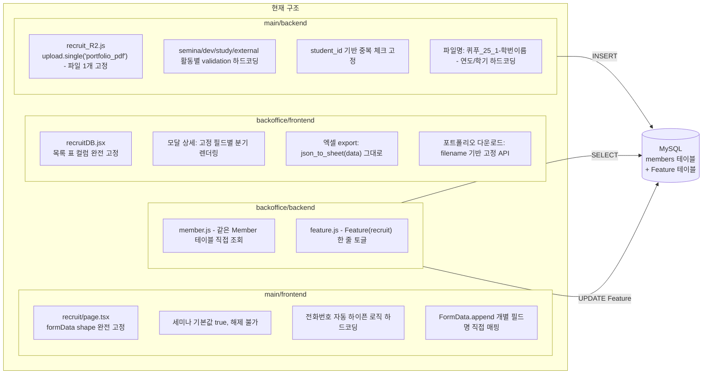

#### 핵심 결합 포인트 상세

**메인 프론트엔드 결합**

| 위치 | 결합 내용 |
|------|----------|
| `recruit/page.tsx:26` | `formData` shape가 완전 고정 |
| `recruit/page.tsx:32, :147` | 세미나는 기본값 `true`, 해제도 막음 |
| `recruit/page.tsx:227` | 전화번호 자동 하이픈 formatting이 입력 로직에 박혀있음 |
| `recruit/page.tsx:358` | 제출 payload가 `FormData.append`를 개별 필드명으로 직접 매핑 |

**메인 백엔드 결합**

| 위치 | 결합 내용 |
|------|----------|
| `recruit_R2.js:16` | `upload.single("portfolio_pdf")` — 파일 필드 1개만 전제 |
| `recruit_R2.js:52` | 활동별 validation이 `semina/dev/study/external` 하드코딩 |
| `recruit_R2.js:89` | 중복 제출 체크가 `student_id` 하나로 고정 |
| `recruit_R2.js:106` | 파일명이 `퀴푸_25_1-${student_id}${name}` 형식 — 연도/학기까지 하드코딩 |

**백오피스 프론트엔드 결합**

| 위치 | 결합 내용 |
|------|----------|
| `recruitDB.jsx:221` | 목록 표 컬럼이 `student.name`, `student.grade`, `student.major` 등 완전 고정 |
| `recruitDB.jsx:299` | 모달 상세도 고정 필드별 분기 렌더링 |
| `recruitDB.jsx:403` | 엑셀 export가 `json_to_sheet(data)` — 동적 필드 구조 들어오면 즉시 깨짐 |
| `recruitDB_api.jsx:55` | 포트폴리오 다운로드가 filename 기반 고정 API |

**백오피스 백엔드 결합**

| 위치 | 결합 내용 |
|------|----------|
| `member.js:9` | 같은 `Member` 테이블을 직접 `SELECT` |
| `recruit.js:3` | 모집 ON/OFF가 폼 단위가 아닌 `Feature(feature_name="recruit")` 한 줄 토글 |
| `feature.js:7`, `app.js:44` | 인증이 세션 + `isLoggedIn` 기반 |

### 1.4 변경 범위 재정의

이번 변경은 폼 UI만 바꾸는 것이 아니라 다음을 한 번에 움직여야 한다:

1. **제출 저장소 변경** — MySQL `members` 테이블 → MongoDB `recruit_responses` 컬렉션
2. **백오피스 조회 방식 변경** — 고정 컬럼 뷰어 → 동적 필드 기반 렌더링
3. **모집 상태 관리 방식 변경** — 전역 Feature toggle → 폼 단위 상태
4. **파일 다운로드 방식 변경** — filename 기반 → responseId + fieldId 기반
5. **백오피스 데이터 export 변경** — 고정 컬럼 → 동적 필드 flatten → CSV
6. **백오피스 인증 모델 전환** — 기존 세션 + `isLoggedIn` → Google OAuth (01-bo-auth 범위)

---

## 2. 목표

백오피스에서 모집 폼을 구글폼처럼 자유롭게 설계하고, 메인 웹은 해당 정의를 기반으로 동적 렌더링한다.

- 연도별 모집 정책 변경 시 **코드 수정 0**, 설정 변경만으로 반영 (핵심: 백오피스/메인 재배포 없이 데이터 정의만 변경)
- 필드 추가/삭제/순서변경/유효성규칙 변경을 백오피스 UI에서 처리
- Regex 기반 커스텀 유효성 검증 지원
- **기존 시스템을 안전하게 떠나는 마이그레이션 경로 확보**

---

## 3. 저장소 기술 결정: MongoDB

### 3.1 프로젝트 전체 방향

2026 Renewal 프로젝트의 기술 스택은 **TypeScript + MongoDB 중심 아키텍처**로 확정되어 있다. (`01-overview.md` §6, §9.3)

- 전체 기술 스택: React, TypeScript, Express, **MongoDB**
- 배포 인프라: 프론트엔드 Vercel, 백엔드 Render, DB **MongoDB Atlas**
- 필수 도구: **MongoDB Compass**

### 3.2 MongoDB가 이 기능에 특히 적합한 이유

- **동적 스키마**: 폼 필드 구조가 연도/학기마다 바뀌므로, 고정 컬럼 스키마보다 도큐먼트 모델이 자연스러움
- **중첩 문서 쿼리**: `answers[].fieldId` / `answers[].value` 기반 중복 체크가 `$elemMatch`로 네이티브 지원
- **인덱싱**: `answers.fieldId` + `answers.value` 복합 인덱스로 중복 체크 성능 확보
- **JSON 직렬화 불필요**: 폼 정의와 응답 구조가 그대로 도큐먼트로 저장/조회됨

---

## 4. 구글폼 분석 기반 설계 원칙

구글폼의 핵심 구조를 분석하여 QUIPU에 필요한 범위만 채택한다.

### 4.1 구글폼 핵심 구조

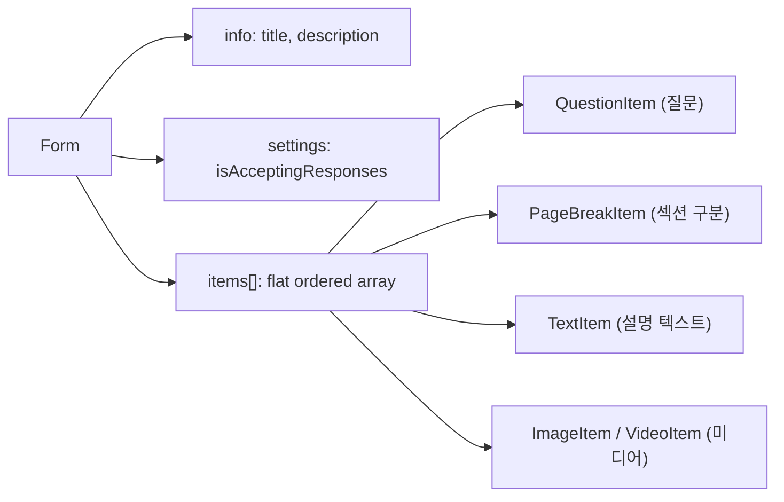

- 섹션은 별도 트리가 아니라 `items[]` 배열에 `pageBreak`를 끼워넣는 **flat 구조**
- 조건 분기는 단일선택(radio/dropdown) 옵션에 `goToSectionId`를 붙이는 방식
- 응답은 `questionId → value` 맵으로 저장 (동적 스키마에 최적)

### 4.2 구글폼 필드 타입 → QUIPU 채택 범위

| 구글폼 타입 | QUIPU 채택 | 비고 |
|------------|-----------|------|
| Short Text | ✅ | 숫자 입력도 `short_text` + `pattern` 검증으로 처리 |
| Paragraph (Long Text) | ✅ | |
| Multiple Choice (Radio) | ✅ | |
| Checkboxes | ✅ | |
| Dropdown | ✅ | |
| File Upload | ✅ | 다중 파일 지원 (`maxFiles`) |
| Linear Scale | ❌ | |
| Date / Time | ❌ | |
| Grid | ❌ | |
| Rating | ❌ | |

> **숫자 입력 정책:** 별도 `number` 필드 타입은 두지 않는다. 숫자 입력이 필요한 경우 `short_text` + `pattern: "^[0-9]+$"` 또는 `min/max` validation으로 처리한다.

### 4.3 구글폼 유효성 검증 → QUIPU 채택 범위

| 구글폼 검증 | QUIPU 채택 |
|------------|-----------|
| Required | ✅ (`FormField.required`로 관리, validation 배열과 분리) |
| Min/Max Length | ✅ |
| Regex Pattern | ✅ |
| Number Range (min/max) | ✅ (`short_text`에 적용, 값을 숫자로 파싱하여 비교) |
| Email / URL 형식 | ✅ (preset 패턴) |
| Custom Error Message | ✅ |

---

## 5. 데이터 모델 (MongoDB)

### 5.1 핵심 설계 결정

| 결정 | 내용 | 근거 |
|------|------|------|
| **required 단일 진실원** | `FormField.required`를 유일한 필수 여부 기준으로 사용한다. `validation[]`에 `"type": "required"`를 포함하지 않는다. | 프론트/백 검증 시 우선순위 충돌 방지 |
| **폼 상태 모델** | `status: "draft" \| "published" \| "closed" \| "archived"` 사용 | 운영 라이프사이클 표현 (초안→게시→종료→보관) |
| **options 자유 변경** | `options[].label`과 `options[].value` 모두 자유롭게 변경 가능. | MongoDB 스키마리스, 운영 유연성 우선 |
| **폼 버전 관리** | `version: number` 필드 추가. 수정마다 +1. 제출 시 클라이언트가 version을 함께 전송. | 작성 중 폼 변경 시 낙관적 동시성 제어 |
| **폼 식별** | `title`로 관리. `year`/`semester`는 메타데이터일 뿐 unique 제약 없음. | 같은 학기에 여러 draft를 만들 수 있어야 하고, 복제 시에도 충돌 없음 |
| **기본 섹션** | 필드는 반드시 섹션에 소속. 폼 생성 시 기본 섹션 1개 자동 생성. | 섹션 없는 필드 방지 |
| **백엔드 검증 원칙** | 프론트엔드를 신뢰하지 않는다. 백엔드에서 모든 검증을 독립적으로 재수행한다. | 보안 |

### 5.2 폼 정의 — `RecruitForm` 컬렉션

```typescript
// ---- 필드 타입 ----
type FieldType =
  | "short_text"
  | "long_text"
  | "single_choice"    // radio
  | "multiple_choice"  // checkbox
  | "dropdown"
  | "file_upload";

// ---- 유효성 검증 규칙 ----
// ⚠️ "required"는 여기 포함하지 않는다. FormField.required를 단일 진실원으로 사용.
type ValidationType = "minLength" | "maxLength" | "min" | "max" | "pattern" | "preset";

interface ValidationRule {
  type: ValidationType;
  value: string | number;
  // type=pattern → value는 regex 문자열 (예: "^[0-9]{10}$")
  // type=preset → value는 "email" | "url" | "phone" | "student_id" | "korean_name" | "number_only"
  // type=min/max → value는 숫자 (short_text의 값을 숫자로 파싱하여 비교)
  // type=minLength/maxLength → value는 숫자
  message: string;  // 검증 실패 시 표시할 에러 메시지
}

// ---- 조건부 표시 규칙 ----
// is_empty, is_not_empty 연산자에는 value가 불필요하므로 optional
interface ConditionalRule {
  fieldId: string;
  operator: "equals" | "not_equals" | "contains" | "is_empty" | "is_not_empty";
  value?: string | string[];  // is_empty, is_not_empty에서는 생략
}

interface ConditionalLogic {
  action: "show" | "hide";
  logicType: "all" | "any";  // AND / OR
  rules: ConditionalRule[];
}

// ---- 섹션 분기 (구글폼 goToSection 방식) ----
interface BranchRule {
  optionValue: string;       // 이 옵션을 선택하면
  goToSectionId: string;     // 이 섹션으로 이동
  goToAction?: "next" | "submit";
}

// ---- 폼 필드 (질문 항목) ----
interface FormField {
  id: string;           // uuid
  type: FieldType;
  label: string;        // 질문 텍스트
  description?: string; // 부가 설명
  placeholder?: string;
  required: boolean;    // ⚠️ 필수 여부의 단일 진실원. validation[]에 required를 넣지 않는다.
  order: number;        // 섹션 내 정렬 순서
  sectionId: string;    // 소속 섹션 id (필드는 반드시 섹션에 소속)
  isListColumn?: boolean; // 백오피스 목록 테이블에 표시할 필드 여부

  // single_choice, multiple_choice, dropdown 전용
  options?: {
    label: string;  // 표시용
    value: string;  // 저장 기준값
  }[];

  // file_upload 전용
  fileConfig?: {
    accept: string[];       // ["application/pdf", "image/*"]
    maxSizeMB: number;      // 기본 5
    maxFiles: number;       // 1이면 단일, 2 이상이면 다중
  };

  // 유효성 검증 (required 제외)
  validation: ValidationRule[];

  // 조건부 표시
  conditionalLogic?: ConditionalLogic;

  // 섹션 분기 (single_choice, dropdown에서만 사용)
  branchRules?: BranchRule[];
}

// ---- 섹션 ----
interface FormSection {
  id: string;
  title: string;
  description?: string;
  order: number;
  // 섹션 단위 조건부 표시 (이 섹션 전체를 조건부로 보이기/숨기기)
  conditionalLogic?: ConditionalLogic;
}

// ---- 폼 상태 ----
type FormStatus = "draft" | "published" | "closed" | "archived";
// draft     → 작성 중. 메인 웹에 노출되지 않음.
// published → 게시됨. 메인 웹에서 조회/제출 가능. 동시에 1개만 published.
// closed    → 모집 종료. 메인 웹에서 "모집 기간이 아닙니다" 표시. 응답 조회 가능.
// archived  → 보관 완료. 백오피스 목록에서 별도 필터로 조회 가능. 데이터는 유지.

// ---- 폼 정의 (최상위) ----
interface RecruitForm {
  _id: ObjectId;
  title: string;              // "QUIPU 2026-1 모집 폼" — 폼의 식별 기준
  description?: string;
  year?: number;              // 메타데이터. unique 제약 없음.
  semester?: number;          // 메타데이터. unique 제약 없음.
  status: FormStatus;         // 폼 운영 상태
  version: number;            // 수정마다 +1. 제출 시 동시성 체크에 사용.

  sections: FormSection[];    // 최소 1개 (기본 섹션 자동 생성)
  fields: FormField[];

  settings: {
    confirmationMessage: string;  // 제출 완료 메시지
    duplicateCheckField?: string; // 중복 체크 기준 필드 id (예: 학번 필드)
  };

  createdBy: string;
  createdAt: Date;
  updatedAt: Date;
}
```

### 5.3 응답 저장 — `RecruitResponse` 컬렉션

```typescript
// ---- 파일 메타데이터 ----
interface FileInfo {
  fileName: string;
  fileKey: string;    // R2 object key
  mimeType: string;
  sizeBytes: number;
}

// ---- 필드 응답 ----
interface FieldAnswer {
  fieldId: string;
  value: string | string[];    // string = text/single_choice/dropdown, string[] = multiple_choice
  files?: FileInfo[];          // file_upload 전용. 단일/다중 모두 배열로 통일.
}

// ---- 제출 응답 ----
interface RecruitResponse {
  _id: ObjectId;
  formId: ObjectId;       // RecruitForm._id 참조
  formVersion: number;    // 제출 시점의 폼 version
  answers: FieldAnswer[];
  submittedAt: Date;
  metadata?: {
    userAgent?: string;
    ip?: string;
  };
}
```

> **file_upload 응답 규칙:** `maxFiles`가 1이든 N이든 `files` 필드는 항상 `FileInfo[]` 배열로 저장한다. 단일 파일이면 길이 1인 배열이다. `value` 필드는 빈 문자열(`""`)로 둔다.

### 5.4 인덱스 설계

```
RecruitForm:
  - { status: 1 }

RecruitResponse:
  - { formId: 1, submittedAt: -1 }
  - { formId: 1, "answers.fieldId": 1, "answers.value": 1 }  // 중복 체크용
```

---

## 6. 동적 폼 런타임 규칙

> 이 섹션은 "폼이 동적으로 동작할 때 어떤 필드가 유효하고, 어떤 값이 제출되는가"를 정의한다. 프론트엔드 상태 관리, 제출 payload 구성, 백엔드 검증 모두 이 규칙을 따른다.

### 6.1 필드 및 섹션 가시성 판정

조건부 표시는 **필드 단위**와 **섹션 단위** 모두 지원한다. 섹션에 `conditionalLogic`이 설정된 경우 해당 섹션 전체가 조건부로 표시/숨김된다. 섹션이 숨겨지면 소속 필드는 개별 `conditionalLogic`과 무관하게 전부 숨겨진다.

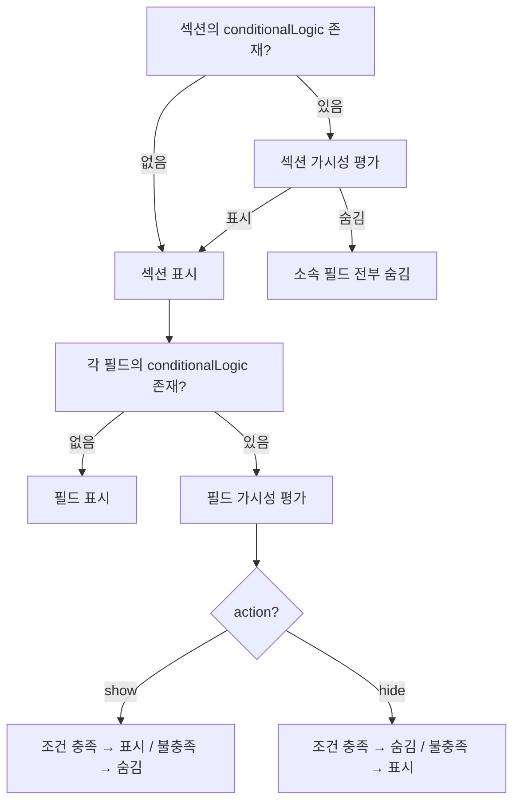

```typescript
function isFieldVisible(
  field: FormField,
  section: FormSection,
  allValues: Record<string, string | string[]>
): boolean {
  // 1. 섹션 단위 조건부 표시 먼저 평가
  if (section.conditionalLogic) {
    const sectionVisible = evaluateLogic(section.conditionalLogic, allValues);
    if (!sectionVisible) return false;
  }

  // 2. 필드 단위 조건부 표시 평가
  if (!field.conditionalLogic) return true;
  return evaluateLogic(field.conditionalLogic, allValues);
}

function evaluateLogic(
  logic: ConditionalLogic,
  allValues: Record<string, string | string[]>
): boolean {
  const { action, logicType, rules } = logic;
  const results = rules.map((rule) => {
    const fieldValue = allValues[rule.fieldId];
    switch (rule.operator) {
      case "equals":
        return fieldValue === rule.value;
      case "not_equals":
        return fieldValue !== rule.value;
      case "contains":
        if (Array.isArray(fieldValue)) {
          return Array.isArray(rule.value)
            ? rule.value.every((v) => fieldValue.includes(v))
            : fieldValue.includes(rule.value as string);
        }
        return typeof fieldValue === "string" && fieldValue.includes(rule.value as string);
      case "is_empty":
        return !fieldValue || (Array.isArray(fieldValue) && fieldValue.length === 0);
      case "is_not_empty":
        return !!fieldValue && (!Array.isArray(fieldValue) || fieldValue.length > 0);
      default:
        return true;
    }
  });
  const conditionMet = logicType === "all" ? results.every(Boolean) : results.some(Boolean);
  return action === "show" ? conditionMet : !conditionMet;
}
```

### 6.2 숨김 필드 정책

| 규칙 | 설명 |
|------|------|
| **숨김 필드의 기존 입력값** | 프론트엔드에서 **제거(clear)한다.** 숨겨진 필드가 다시 보일 때 사용자는 처음부터 입력한다. |
| **제출 payload** | 숨겨진 필드의 값은 **제출 payload에 포함하지 않는다.** |
| **백엔드 validation** | 숨겨진 필드는 **validation 대상에서 제외한다.** `required: true`여도 숨겨져 있으면 검증하지 않는다. |

### 6.3 섹션 분기(Branch) 정책

`branchRules`가 있는 필드에서 사용자의 선택에 따라 특정 섹션으로 이동할 수 있다. 이때 건너뛴 섹션의 필드는 숨김 필드와 동일하게 처리한다.

| 규칙 | 설명 |
|------|------|
| **유효 응답 판정** | 현재 경로(branch path)에 포함된 섹션의 필드만 유효 응답이다. |
| **건너뛴 섹션** | 해당 섹션의 모든 필드 값을 제출 payload에서 제외한다. |
| **백엔드 validation** | 건너뛴 섹션의 필드는 validation 대상에서 제외한다. |

### 6.4 폼 버전 동시성 제어

사용자가 폼을 조회한 뒤 작성하는 동안 운영자가 폼을 수정하거나 상태를 변경할 수 있다.

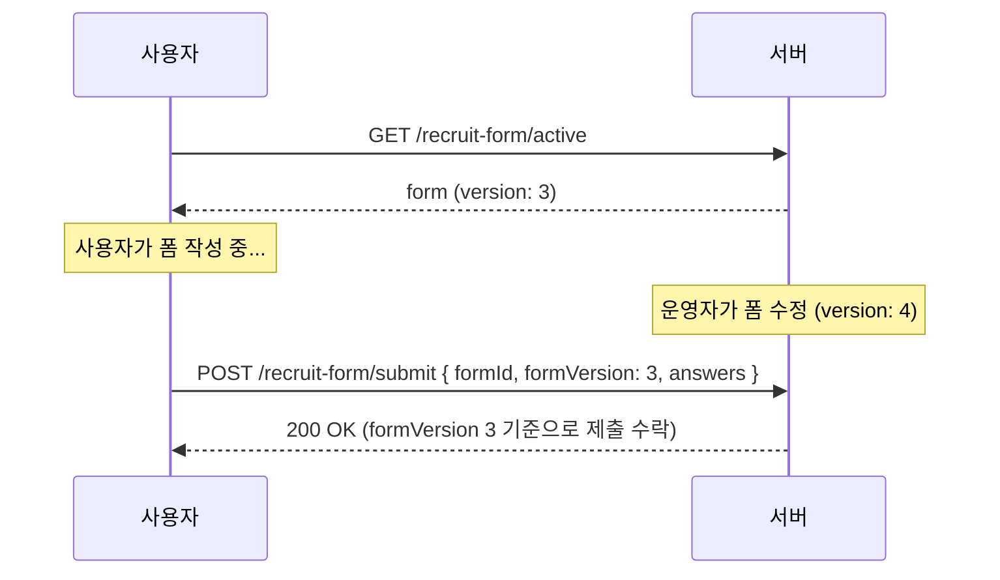

- 제출 시 클라이언트는 `formId`와 함께 조회한 폼의 `version`을 전송한다.
- 서버는 제출된 `formVersion`이 현재 폼의 `version`과 다르더라도 **제출을 수락**한다. 작성 중이던 응답 유실을 방지하기 위함이다.
- 응답에는 제출 시점의 `formVersion`을 함께 저장하여, 어떤 버전의 폼 기준으로 작성되었는지 추적한다.
- 운영자는 **모집 기간 중 불필요한 수정을 자제해야 한다.**

#### 고정 필드 (Fixed Fields) 정책

폼 버전이 변경되더라도 항상 유지되는 **고정 필드**를 정의한다:

| 고정 필드 | 용도 |
|-----------|------|
| 이름 | 식별, 목록 표시 |
| 학번 | 중복 체크, 식별 |
| 학과 | 목록 표시 |
| 이메일 | 연락, 단체 메일 |

- 고정 필드는 published 상태에서 삭제하거나 타입을 변경할 수 없다.
- 백오피스 응답 목록(테이블)에서는 고정 필드 중심으로 렌더링한다.
- 각 row 클릭 시 모달에서 해당 응답의 `formVersion`에 맞는 폼 정의를 기준으로 상세 응답을 렌더링한다.

#### 버전별 데이터 처리

- **백오피스 테이블**: 고정 필드(이름, 학번, 학과, 이메일)를 컬럼으로 표시. 버전에 무관하게 동일한 형태.
- **모달 상세**: 응답의 `formVersion`에 해당하는 폼 정의를 참조하여 필드별 라벨-값 쌍을 렌더링.
- **CSV/Excel export**: 버전별로 시트를 분리하여 출력. 각 시트는 해당 버전의 폼 필드를 컬럼으로 사용.

#### published 상태 수정 제한 강화

published 상태에서는 **폼 구성(필드 추가/삭제/타입 변경)을 불허**한다. 옵션 라벨, 필드 라벨, 검증 규칙 등 비구조적 속성만 변경 가능하며, 변경 시 `version`이 +1 된다.

### 6.5 options 변경 정책

선택형 필드(`single_choice`, `multiple_choice`, `dropdown`)의 `options`는 응답 존재 여부와 무관하게 자유롭게 변경할 수 있다.

- `options[].label`, `options[].value` 모두 수정/추가/삭제 가능.
- 과거 응답은 제출 시점의 `value`를 그대로 보존한다. 옵션이 변경되더라도 기존 응답 데이터는 영향받지 않는다.
- 백오피스 응답 조회 시, 현재 폼 정의에 없는 `value`가 과거 응답에 있을 수 있다. 이 경우 `value`를 그대로 표시한다.

### 6.6 백엔드 검증 원칙

> **프론트엔드를 신뢰하지 않는다.** 백엔드는 폼 정의를 기준으로 모든 검증을 독립적으로 재수행한다.

백엔드 제출 처리 시 다음을 순서대로 수행한다:

1. **폼 상태 체크** — `status === "published"`인지 확인
2. **폼 버전 기록** — 클라이언트가 보낸 `formVersion`을 응답에 저장 (구버전 제출도 허용)
3. **중복 제출 체크** — `duplicateCheckField` 기반
4. **가시성 재평가** — 클라이언트가 보낸 answers를 기준으로 각 필드/섹션의 `conditionalLogic`을 재평가하여 visible 필드 목록을 서버에서 독립적으로 산출
5. **visible 필드만 validation** — `required`, `validation[]` 규칙, **선택형 필드의 option value 유효성** (폼 정의에 존재하는 값인지) 모두 체크
6. **payload에 없어야 할 필드 제거** — 숨김 필드의 답변이 payload에 포함되어 있으면 무시(저장하지 않음)

---

## 7. 마이그레이션 전략

> **"새 시스템을 어떻게 만들지"도 중요하지만, "기존 시스템을 어떻게 안전하게 떠날지"가 더 중요하다.**

### 7.1 기본 원칙

기존 MySQL/Sequelize 기반 시스템을 **완전히 대체**한다.

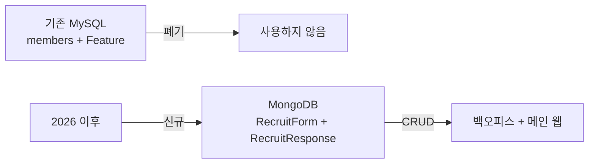

| 구분 | 전략 |
|------|------|
| **2025 이전 데이터** | 자동 마이그레이션하지 않는다. 기존 데이터가 필요할 경우 개발자가 MySQL에서 MongoDB로 수동 마이그레이션한다. |
| **2026 이후 데이터** | MongoDB `RecruitForm` + `RecruitResponse`만 사용. |
| **기존 코드** | `recruitDB.jsx`, `Member.js`, `recruit_R2.js` 등은 새 코드로 완전 대체. |

### 7.2 모집 상태(ON/OFF) 전환 전략

현재 모집 ON/OFF는 `Feature(feature_name="recruit")` 한 줄 토글이다. 새 시스템에서는 `RecruitForm.status`로 이동한다.

| 항목 | 결정 |
|------|------|
| `Feature.recruit` 레코드 | **폐기한다.** 새 폼의 `status`가 대체한다. |
| 상태 매핑 | `status === "published"` = 모집 진행 중 (기존 `Feature.recruit === true`에 대응) |
| 메인 웹 판단 로직 | `status === "published"`인 폼이 존재하면 해당 폼을 렌더링, 없으면 "모집 기간이 아닙니다" |

### 7.3 백오피스 응답 조회

백오피스 응답 조회는 새 `ResponseList.tsx`에서 MongoDB `recruit_responses`를 조회하며, 폼 정의 기반으로 동적 컬럼을 렌더링한다. 기존 `recruitDB.jsx`는 완전 대체한다.

### 7.4 파일 다운로드 방식 전환

| 항목 | 기존 | 변경 후 |
|------|------|--------|
| 파일 식별 | filename 기반 (`퀴푸_25_1-학번이름.pdf`) | `responseId + fieldId` 기반 메타 조회 |
| 다운로드 API | `GET /bo/recruit/download/:filename` | `GET /bo/recruit-form/:formId/responses/:responseId/file/:fieldId` |
| R2 키 형식 | 하드코딩 패턴 | `recruit/{formId}/{responseId}/{fieldId}/{originalFilename}` |
| 백오피스 UX | 고정 "포트폴리오 다운로드" 버튼 | 응답 상세에서 `file_upload` 타입 필드마다 다운로드 링크 동적 생성 |
| URL 보안 | 없음 | 시간 제한 있는 서명된 URL 발급 (만료: 1시간) |

### 7.5 백오피스 인증 모델

> **결정:** 새 `/bo/recruit-form/*` API는 **01-bo-auth에서 구축하는 Google OAuth 미들웨어를 사용한다.**

### 7.6 전환 타임라인

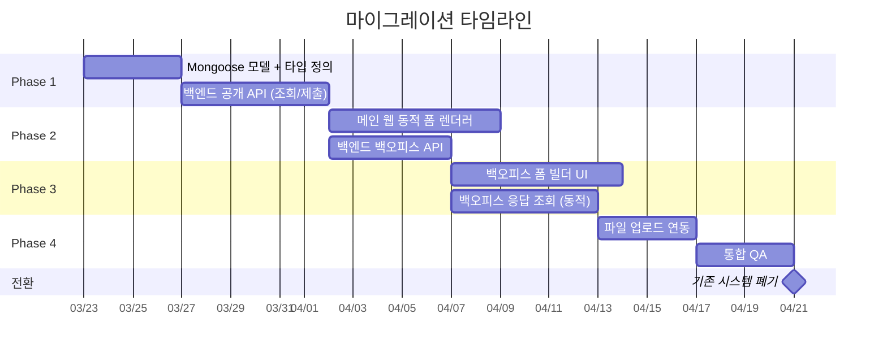

---

## 8. API 설계

### 8.1 백오피스 API (폼 관리)

| Method | Path | 설명 |
|--------|------|------|
| `POST` | `/bo/recruit-form` | 폼 생성 (status: draft, 기본 섹션 1개 자동 생성) |
| `GET` | `/bo/recruit-form` | 폼 목록 조회 (전체 상태 포함, 상태별 필터 지원) |
| `GET` | `/bo/recruit-form/:id` | 폼 상세 조회 |
| `PUT` | `/bo/recruit-form/:id` | 폼 수정 (version +1) |
| `DELETE` | `/bo/recruit-form/:id` | 폼 삭제 (응답 있으면 불가) |
| `PATCH` | `/bo/recruit-form/:id/status` | 상태 전환 |
| `POST` | `/bo/recruit-form/:id/copy` | 폼 복제 (title, year, semester를 새로 지정) |

> **인증:** 모든 `/bo/*` API는 01-bo-auth의 Google OAuth 인증 미들웨어 적용.

### 8.2 백오피스 API (응답 관리)

| Method | Path | 설명 |
|--------|------|------|
| `GET` | `/bo/recruit-form/:id/responses` | 응답 목록 (페이지네이션: `?cursor=&limit=20`) |
| `GET` | `/bo/recruit-form/:id/responses/:responseId` | 응답 상세 |
| `POST` | `/bo/recruit-form/:id/responses` | 응답 수동 추가 (백오피스에서만 가능) |
| `PUT` | `/bo/recruit-form/:id/responses/:responseId` | 응답 수정 (백오피스에서만 가능) |
| `DELETE` | `/bo/recruit-form/:id/responses/:responseId` | 응답 삭제 (백오피스에서만 가능) |
| `GET` | `/bo/recruit-form/:id/responses/:responseId/file/:fieldId` | 파일 다운로드 (시간 제한 서명 URL, 만료 1시간) |

### 8.3 메인 웹 API (공개)

| Method | Path | 설명 |
|--------|------|------|
| `GET` | `/recruit-form/active` | published 상태 폼 조회 (version 포함) |
| `POST` | `/recruit-form/submit` | 폼 제출 (formId + formVersion + answers) |

### 8.4 응답 목록 페이지네이션

cursor 기반 페이지네이션을 사용한다:

```
GET /bo/recruit-form/:id/responses?limit=20
GET /bo/recruit-form/:id/responses?limit=20&cursor={lastResponseId}
```

- `limit`: 한 페이지당 응답 수 (기본 20, 최대 100)
- `cursor`: 마지막 응답의 `_id`. 다음 페이지 조회 시 사용.
- 응답은 `submittedAt` 역순(최신순) 정렬.

### 8.5 CSV Export

백오피스에서 응답 데이터를 내보낼 때는 **프론트엔드에서 CSV를 빌드**한다.

| 항목 | 결정 |
|------|------|
| 생성 주체 | 프론트엔드 (백엔드 API로 전체 응답을 조회한 뒤 클라이언트에서 CSV 생성) |
| 형식 | CSV (UTF-8 BOM 포함, 한글 호환) |
| 컬럼 구성 | `flattenResponses()` 결과 기반. 폼 정의의 필드 순서대로 컬럼 생성. |
| 라이브러리 | 별도 라이브러리 없이 직접 CSV 문자열 생성 또는 경량 라이브러리 사용 |

---

## 9. Regex 유효성 검증 시스템

### 9.1 Preset 패턴

| Preset ID | 패턴 | 용도 |
|-----------|------|------|
| `phone` | `^010-[0-9]{4}-[0-9]{4}$` | 전화번호 |
| `email` | `^[^\s@]+@[^\s@]+\.[^\s@]+$` | 이메일 |
| `url` | `^https?:\/\/.+` | URL |
| `student_id` | `^[0-9]{10}$` | 학번 (10자리) |
| `korean_name` | `^[가-힣]{2,5}$` | 한글 이름 |
| `number_only` | `^[0-9]+$` | 숫자만 |

### 9.2 커스텀 Regex 정책

운영자가 직접 정규식을 입력할 수 있되, 안전장치를 적용한다:

| 제한 | 내용 |
|------|------|
| **길이 제한** | regex 문자열 최대 200자 |
| **금지 패턴** | 재귀적/중첩 quantifier 차단 (예: `(a+)+`, `(a*)*`) |
| **서버 검증** | 저장 시 `new RegExp(input)`으로 문법 검증 + 테스트 입력에 대해 100ms 내 실행 확인 |
| **런타임 보호** | `safe-regex` 라이브러리로 ReDoS 취약 패턴 사전 차단 |

```json
{
  "type": "pattern",
  "value": "^[A-Z]{2}[0-9]{4}$",
  "message": "코드 형식이 올바르지 않습니다 (예: AB1234)"
}
```

### 9.3 프론트엔드 검증 흐름

```typescript
function validateField(
  field: FormField,
  value: string | string[],
  files?: FileInfo[]
): string | null {
  // 1. required 체크 (validation[]과 별도)
  if (field.required) {
    if (field.type === "file_upload") {
      if (!files || files.length === 0) return `${field.label}을(를) 업로드해주세요.`;
    } else if (field.type === "multiple_choice") {
      if (!Array.isArray(value) || value.length === 0) return `${field.label}을(를) 선택해주세요.`;
    } else {
      if (!value || (typeof value === "string" && !value.trim())) return `${field.label}을(를) 입력해주세요.`;
    }
  }

  // 2. file_upload는 별도 검증 (accept, maxSizeMB, maxFiles)
  if (field.type === "file_upload" && files && files.length > 0) {
    if (field.fileConfig) {
      if (files.length > field.fileConfig.maxFiles) {
        return `최대 ${field.fileConfig.maxFiles}개까지 업로드할 수 있습니다.`;
      }
      for (const file of files) {
        if (file.sizeBytes > field.fileConfig.maxSizeMB * 1024 * 1024) {
          return `파일 크기는 ${field.fileConfig.maxSizeMB}MB 이하여야 합니다.`;
        }
      }
    }
    return null;
  }

  // 3. multiple_choice는 validation[] 규칙 적용하지 않음 (required만 체크)
  if (field.type === "multiple_choice") return null;

  // 4. text/single_choice/dropdown에 대해 validation[] 규칙 적용
  const strValue = typeof value === "string" ? value : "";
  if (!strValue) return null;

  for (const rule of field.validation) {
    switch (rule.type) {
      case "minLength":
        if (strValue.length < Number(rule.value)) return rule.message;
        break;
      case "maxLength":
        if (strValue.length > Number(rule.value)) return rule.message;
        break;
      case "min":
        if (Number(strValue) < Number(rule.value)) return rule.message;
        break;
      case "max":
        if (Number(strValue) > Number(rule.value)) return rule.message;
        break;
      case "pattern":
        try {
          const regex = new RegExp(rule.value as string);
          if (!regex.test(strValue)) return rule.message;
        } catch {
          // 잘못된 regex는 무시 (백오피스에서 사전 검증)
        }
        break;
      case "preset":
        const presetPatterns: Record<string, RegExp> = {
          phone: /^010-[0-9]{4}-[0-9]{4}$/,
          email: /^[^\s@]+@[^\s@]+\.[^\s@]+$/,
          url: /^https?:\/\/.+/,
          student_id: /^[0-9]{10}$/,
          korean_name: /^[가-힣]{2,5}$/,
          number_only: /^[0-9]+$/,
        };
        const preset = presetPatterns[rule.value as string];
        if (preset && !preset.test(strValue)) return rule.message;
        break;
    }
  }
  return null;
}
```

### 9.4 백오피스 Regex 입력 UI 안전장치

1. 입력 즉시 `new RegExp(input)` 으로 문법 검증 → 실패 시 에러 표시
2. `safe-regex` 라이브러리로 ReDoS 취약 여부 경고
3. 테스트 입력란 제공 — 샘플 값을 넣어서 매칭 여부 실시간 확인
4. 저장 시 서버에서도 regex 문법 + 안전성 재검증

---

## 10. 동적 응답 Flatten 전략

### 10.1 문제

동적 폼의 응답은 `answers: [{ fieldId, value }, ...]` 형태의 배열이다. 백오피스에서는 이 데이터를 세 가지 형태로 표시해야 한다:

1. **목록 테이블** — 각 필드가 컬럼으로 펼쳐져야 함
2. **모달 상세** — 필드별 라벨-값 쌍으로 렌더링
3. **CSV 내보내기** — 각 필드가 CSV 컬럼이 되어야 함

### 10.2 Flatten 유틸

```typescript
function flattenResponses(
  form: RecruitForm,
  responses: RecruitResponse[]
): Record<string, string>[] {
  const orderedFields = [...form.fields].sort((a, b) => {
    const secA = form.sections.find(s => s.id === a.sectionId)?.order ?? 0;
    const secB = form.sections.find(s => s.id === b.sectionId)?.order ?? 0;
    return secA !== secB ? secA - secB : a.order - b.order;
  });

  return responses.map((resp) => {
    const row: Record<string, string> = {
      "제출일시": resp.submittedAt.toISOString(),
    };
    for (const field of orderedFields) {
      const answer = resp.answers.find(a => a.fieldId === field.id);
      if (!answer) {
        row[field.label] = "";
      } else if (answer.files && answer.files.length > 0) {
        row[field.label] = answer.files.map(f => f.fileName).join(", ");
      } else if (Array.isArray(answer.value)) {
        row[field.label] = answer.value.join(", ");
      } else {
        row[field.label] = answer.value;
      }
    }
    return row;
  });
}
```

### 10.3 적용 위치

| 용도 | 구현 |
|------|------|
| **목록 테이블** | `isListColumn: true`인 필드만 컬럼으로 표시. 폼 정의의 필드 라벨을 헤더로 동적 생성. |
| **모달 상세** | 응답의 `answers[]`를 폼 정의의 `fields[]`와 매칭하여 전체 필드의 라벨-값 쌍 렌더링. |
| **CSV 내보내기** | 프론트엔드에서 `flattenResponses` 결과로 CSV 문자열 생성 후 다운로드. 전체 필드 포함. |

---

## 11. 중복 제출 방지

`settings.duplicateCheckField`에 지정된 필드(예: 학번)를 기준으로 중복 체크한다.

### 11.1 조회 전략

MongoDB의 `$elemMatch`를 사용하여 `answers` 배열 내에서 정확한 매칭을 보장한다:

```typescript
async function handleSubmit(formId: string, formVersion: number, answers: FieldAnswer[]) {
  const form = await RecruitForm.findById(formId);

  // 1. 폼 상태 체크
  if (form.status !== "published") {
    throw new BadRequestError("현재 모집 기간이 아닙니다.");
  }

  // 2. 폼 버전 기록 (구버전 제출도 허용 — 작성 중 응답 유실 방지)
  // formVersion은 응답에 저장하여 버전별 추적에 사용

  // 3. 중복 제출 체크
  if (form.settings.duplicateCheckField) {
    const checkAnswer = answers.find(
      (a) => a.fieldId === form.settings.duplicateCheckField
    );
    if (checkAnswer) {
      const existing = await RecruitResponse.findOne({
        formId: form._id,
        answers: {
          $elemMatch: {
            fieldId: checkAnswer.fieldId,
            value: checkAnswer.value,
          },
        },
      });
      if (existing) {
        throw new ConflictError("이미 제출하셨습니다.");
      }
    }
  }

  // 4. 백엔드 검증 (§6.6 참조)
  // 5. 저장
  await RecruitResponse.create({
    formId: form._id,
    formVersion: form.version,
    answers,
    submittedAt: new Date(),
  });
}
```

### 11.2 인덱스 활용

`{ formId: 1, "answers.fieldId": 1, "answers.value": 1 }` 복합 인덱스가 `$elemMatch` 쿼리를 커버한다. 모집 기간 동안의 응답 수가 수백 건 수준이므로 성능 이슈 가능성은 낮다.

---

## 12. 파일 업로드 처리

### 12.1 업로드 흐름 (Presigned URL 방식)

> **방침:** `02-activity-cms`에서 제안된 Presigned URL 방식과 통일한다. 초기 구현에서는 파일 URL을 직접 입력받는 간단한 방식으로 시작하고, `02-activity-cms`의 파일 업로드 기능이 완성되면 해당 컴포넌트를 재사용한다.

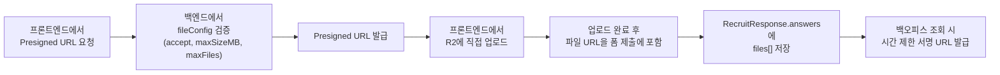

#### 초기 구현 (Phase 1)
- `file_upload` 타입 필드에서 파일 URL을 텍스트로 입력받는 방식으로 시작.
- 프론트엔드 파일 선택 UI 없이, 외부 업로드 후 URL 붙여넣기.

#### 완성 구현 (Phase 2 — `02-activity-cms` 완성 후)
- `02-activity-cms`에서 구현된 Presigned URL 업로드 컴포넌트를 재사용.
- 프론트엔드에서 Cloudflare R2에 직접 업로드하고, 발급된 URL을 답변에 저장.

### 12.2 기존 대비 변경점

| 항목 | 기존 | 변경 |
|------|------|------|
| 업로드 방식 | `multipart/form-data` → 백엔드 중계 | Presigned URL → 프론트엔드에서 R2 직접 업로드 |
| 파일 필드 수 | `upload.single("portfolio_pdf")` — 1개 고정 | 폼 정의의 `file_upload` 필드 수만큼 동적 |
| 파일 수 | 필드당 1개 | `maxFiles`에 따라 필드당 N개 |
| 파일명 패턴 | `퀴푸_25_1-${student_id}${name}` 하드코딩 | `recruit/{formId}/{responseId}/{fieldId}/{originalFilename}` |
| 다운로드 | filename 기반 고정 API | responseId + fieldId 기반 → 시간 제한 서명 URL (만료 1시간) |
| accept 검증 | 없음 | **프론트엔드**: `<input accept>` 속성 + 클라이언트 MIME 체크. **백엔드**: Presigned URL 발급 시 `fileConfig.accept`와 매칭 |
| 응답 저장 | 단일 `fileInfo` 객체 | `files: FileInfo[]` 배열 (단일/다중 통일) |

### 12.3 업로드 실패 복구

R2 업로드와 DB 저장 사이에 실패가 발생할 수 있다. Orphan file(DB에 기록되지 않은 R2 파일) 정리 정책:

| 시나리오 | 대응 |
|---------|------|
| R2 업로드 성공 → DB 저장 실패 | 업로드된 R2 파일을 즉시 삭제 시도. 실패 시 로그 기록. |
| 일괄 정리 | 주기적 배치(일 1회)로 `recruit/` 프리픽스 아래 R2 오브젝트와 DB의 `files[].fileKey`를 대조하여 orphan 파일 삭제. |

---

## 13. 백오피스 폼 빌더 UI 설계

### 13.1 화면 구성

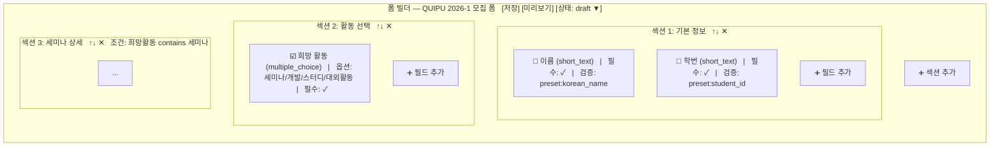

### 13.2 필드 설정 패널

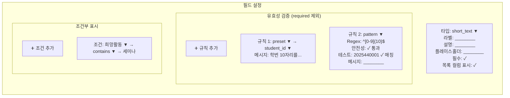

### 13.3 핵심 인터랙션

- **드래그 앤 드롭**으로 필드/섹션 순서 변경 (`order` 값 자동 재계산)
- **미리보기** 버튼 → 메인 웹 폼 렌더러를 **iframe**으로 로드하여 실제 렌더링 결과 확인
- **폼 복제** 기능 → 전년도 폼을 복사하면서 title, year, semester를 새로 지정
- **상태 전환** 버튼 → draft ↔ published ↔ closed → archived

### 13.4 상태 전환 규칙

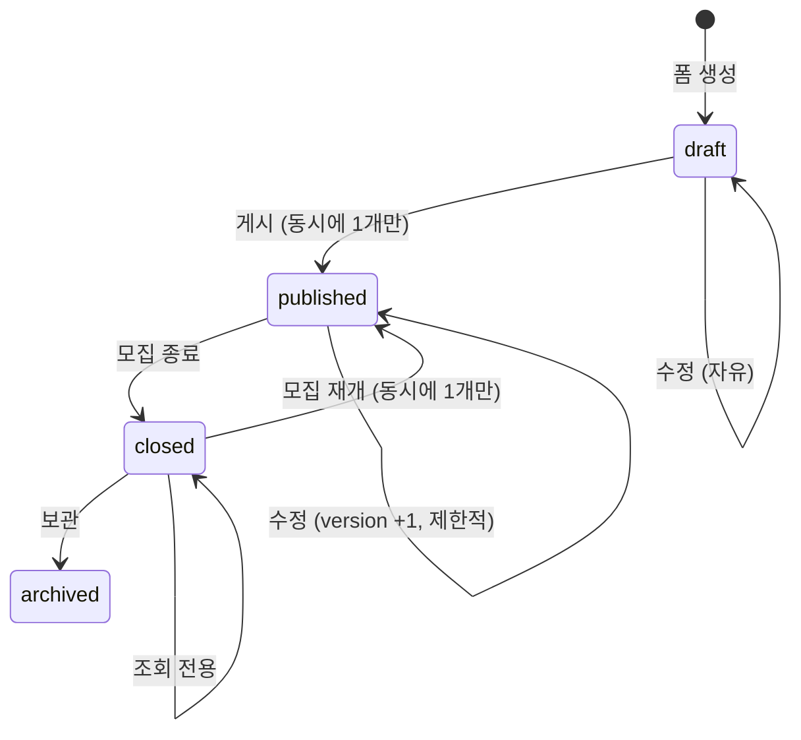

| 전환 | 조건 |
|------|------|
| draft → published | 다른 published 폼이 없어야 함. 필드가 1개 이상 존재해야 함. |
| published → closed | 언제든 가능. |
| closed → published | 다른 published 폼이 없어야 함. (모집 재개) |
| closed → archived | 언제든 가능. |
| published 상태에서 수정 | 필드 추가/삭제/타입 변경 불가. 옵션/라벨/검증 등 비구조적 속성만 변경 가능. version +1. |

---

## 14. 메인 웹 폼 렌더러 설계

### 14.1 렌더링 흐름

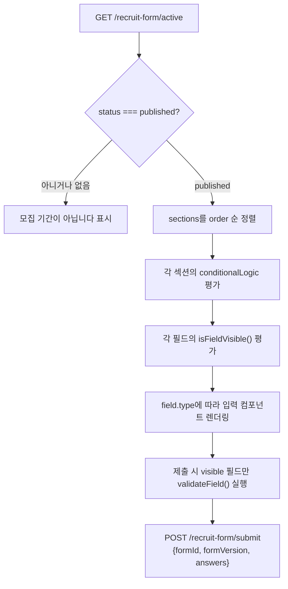

### 14.2 필드 타입별 렌더링 컴포넌트 매핑

```typescript
const FIELD_COMPONENTS: Record<FieldType, React.FC<FieldRendererProps>> = {
  short_text:      ShortTextField,
  long_text:       LongTextField,
  single_choice:   RadioField,
  multiple_choice: CheckboxField,
  dropdown:        DropdownField,
  file_upload:     FileUploadField,
};
```

### 14.3 미리보기 연동

백오피스 폼 빌더의 **미리보기**는 메인 웹 폼 렌더러를 **iframe**으로 로드한다.

- 백오피스에서 `<iframe src="/recruit?preview=true&formId={id}" />`로 임베드
- 메인 웹 폼 렌더러는 `preview=true` 쿼리 파라미터가 있으면 draft 상태 폼도 렌더링 (published가 아니어도 표시)
- 이 방식으로 백오피스에서 별도 렌더러를 구현하지 않아도 실제와 동일한 미리보기를 제공한다.

---

## 15. 디렉토리 구조 (신규)

### 백엔드 (Express + TypeScript + MongoDB)

```
backend/src/
├── models/
│   ├── RecruitForm.ts          # 폼 정의 Mongoose 모델
│   └── RecruitResponse.ts      # 응답 Mongoose 모델
├── routes/
│   ├── bo/
│   │   └── recruitForm.ts      # 백오피스 폼 CRUD + 응답 조회/삭제
│   └── public/
│       └── recruitForm.ts      # 메인 웹 폼 조회 + 제출
├── services/
│   └── recruitForm.ts          # 비즈니스 로직 (검증, 중복체크, 파일처리, flatten)
├── utils/
│   ├── validation.ts           # 공용 유효성 검증 함수 (validateField)
│   ├── visibility.ts           # 공용 가시성 판정 함수 (isFieldVisible)
│   ├── flatten.ts              # 동적 응답 → 테이블/CSV용 변환
│   ├── safeRegex.ts            # Regex 안전성 검증 (safe-regex 래퍼)
│   └── r2.ts                   # R2 업로드 (기존 재활용)
└── types/
    └── recruitForm.ts          # 공용 타입 정의
```

### 백오피스 프론트엔드

```
frontend/src/
├── pages/
│   └── recruit/
│       ├── FormList.tsx         # 폼 목록
│       ├── FormBuilder.tsx      # 폼 빌더 (메인 화면)
│       └── ResponseList.tsx     # 응답 목록/상세 (동적 컬럼)
├── components/
│   └── form-builder/
│       ├── SectionCard.tsx
│       ├── FieldCard.tsx
│       ├── FieldSettings.tsx
│       ├── ValidationEditor.tsx
│       ├── RegexTester.tsx
│       └── FormPreview.tsx      # iframe 기반 미리보기
```

### 메인 웹 프론트엔드

```
frontend/src/
├── app/
│   └── recruit/
│       └── page.tsx             # 동적 폼 렌더러 (preview 모드 지원)
├── components/
│   └── recruit/
│       ├── FormRenderer.tsx
│       ├── SectionRenderer.tsx
│       ├── fields/
│       │   ├── ShortTextField.tsx
│       │   ├── LongTextField.tsx
│       │   ├── RadioField.tsx
│       │   ├── CheckboxField.tsx
│       │   ├── DropdownField.tsx
│       │   └── FileUploadField.tsx
│       └── validation/
│           ├── useFieldValidation.ts
│           └── useFieldVisibility.ts
├── types/
│   └── recruitForm.ts
└── hooks/
    └── useRecruitForm.ts
```

---

## 16. 현재 폼 → 동적 폼 마이그레이션 예시

현재 하드코딩된 2025년 모집 폼을 동적 구조로 표현하면 이렇게 된다:

```json
{
  "title": "QUIPU 2025-1 모집 폼",
  "year": 2025,
  "semester": 1,
  "status": "closed",
  "version": 1,
  "sections": [
    { "id": "sec_basic", "title": "기본 정보", "order": 1 },
    { "id": "sec_activity", "title": "활동 선택", "order": 2 },
    {
      "id": "sec_semina", "title": "세미나 상세", "order": 3,
      "conditionalLogic": {
        "action": "show", "logicType": "all",
        "rules": [{ "fieldId": "f_activity", "operator": "contains", "value": "semina" }]
      }
    },
    {
      "id": "sec_dev", "title": "개발 상세", "order": 4,
      "conditionalLogic": {
        "action": "show", "logicType": "all",
        "rules": [{ "fieldId": "f_activity", "operator": "contains", "value": "dev" }]
      }
    },
    {
      "id": "sec_study", "title": "스터디 상세", "order": 5,
      "conditionalLogic": {
        "action": "show", "logicType": "all",
        "rules": [{ "fieldId": "f_activity", "operator": "contains", "value": "study" }]
      }
    },
    {
      "id": "sec_external", "title": "대외활동 상세", "order": 6,
      "conditionalLogic": {
        "action": "show", "logicType": "all",
        "rules": [{ "fieldId": "f_activity", "operator": "contains", "value": "external" }]
      }
    }
  ],
  "fields": [
    {
      "id": "f_name", "type": "short_text", "label": "이름",
      "placeholder": "이퀴푸", "required": true, "order": 1,
      "sectionId": "sec_basic", "isListColumn": true,
      "validation": [{ "type": "preset", "value": "korean_name", "message": "한글 이름을 입력해주세요 (2~5자)" }]
    },
    {
      "id": "f_major", "type": "dropdown", "label": "학과",
      "required": true, "order": 2, "sectionId": "sec_basic", "isListColumn": true,
      "options": [
        { "label": "전자전기컴퓨터공학부", "value": "전자전기컴퓨터공학부" },
        { "label": "컴퓨터과학부", "value": "컴퓨터과학부" },
        { "label": "인공지능학과", "value": "인공지능학과" }
      ],
      "validation": []
    },
    {
      "id": "f_grade", "type": "single_choice", "label": "학년",
      "required": true, "order": 3, "sectionId": "sec_basic", "isListColumn": true,
      "options": [
        { "label": "1학년", "value": "1" }, { "label": "2학년", "value": "2" },
        { "label": "3학년", "value": "3" }, { "label": "4학년", "value": "4" }
      ],
      "validation": []
    },
    {
      "id": "f_student_id", "type": "short_text", "label": "학번",
      "placeholder": "2025440000", "required": true, "order": 4,
      "sectionId": "sec_basic", "isListColumn": true,
      "validation": [{ "type": "preset", "value": "student_id", "message": "학번 10자리를 정확히 입력해주세요" }]
    },
    {
      "id": "f_phone", "type": "short_text", "label": "전화번호",
      "placeholder": "010-1234-5678", "required": true, "order": 5, "sectionId": "sec_basic",
      "validation": [{ "type": "preset", "value": "phone", "message": "010-0000-0000 형식으로 입력해주세요" }]
    },
    {
      "id": "f_activity", "type": "multiple_choice",
      "label": "하고 싶은 활동을 선택하세요 (복수 선택 가능)",
      "required": true, "order": 1, "sectionId": "sec_activity", "isListColumn": true,
      "options": [
        { "label": "세미나", "value": "semina" }, { "label": "개발", "value": "dev" },
        { "label": "스터디", "value": "study" }, { "label": "대외 활동", "value": "external" }
      ],
      "validation": []
    },
    {
      "id": "f_motivation_semina", "type": "long_text",
      "label": "발표하고 싶은 주제 & 듣고 싶은 주제",
      "placeholder": "네트워크 관련 주제를 듣고 싶어요!",
      "required": true, "order": 1, "sectionId": "sec_semina", "validation": []
    },
    {
      "id": "f_field_dev", "type": "single_choice", "label": "개발 분야",
      "required": true, "order": 1, "sectionId": "sec_dev",
      "options": [
        { "label": "기획", "value": "기획" }, { "label": "디자인", "value": "디자인" },
        { "label": "프론트엔드", "value": "프론트엔드" }, { "label": "백엔드", "value": "백엔드" }
      ],
      "validation": []
    },
    {
      "id": "f_portfolio", "type": "file_upload", "label": "포트폴리오 (PDF, 5MB 이하)",
      "required": true, "order": 2, "sectionId": "sec_dev",
      "fileConfig": { "accept": ["application/pdf"], "maxSizeMB": 5, "maxFiles": 1 },
      "validation": []
    },
    {
      "id": "f_github", "type": "short_text", "label": "깃허브 프로필 URL",
      "placeholder": "https://github.com/Quipu-Developers",
      "required": true, "order": 3, "sectionId": "sec_dev",
      "validation": [{ "type": "preset", "value": "url", "message": "올바른 URL을 입력해주세요" }]
    },
    {
      "id": "f_motivation_study", "type": "long_text", "label": "참여하고 싶은 스터디",
      "placeholder": "파이썬 스터디에 참여하고 싶어요!",
      "required": true, "order": 1, "sectionId": "sec_study", "validation": []
    },
    {
      "id": "f_motivation_external", "type": "long_text", "label": "참여하고 싶은 대외 활동",
      "placeholder": "해커톤에 나가고 싶어요!",
      "required": true, "order": 1, "sectionId": "sec_external", "validation": []
    }
  ],
  "settings": {
    "confirmationMessage": "신청이 완료되었습니다!",
    "duplicateCheckField": "f_student_id"
  }
}
```

> **참고:** 섹션 단위 `conditionalLogic`을 사용하므로 각 필드에 개별 `conditionalLogic`을 반복할 필요가 없다.

---

## 17. 구현 우선순위

| 순서 | 항목 | 설명 | 의존성 |
|:----:|------|------|--------|
| 0 | 01-bo-auth 완료 대기 | Google OAuth 인증 미들웨어 | — |
| 1 | Mongoose 모델 + 타입 정의 | `RecruitForm`, `RecruitResponse` 스키마 | MongoDB Atlas 연결 |
| 2 | 백엔드 공개 API | `GET /recruit-form/active`, `POST /recruit-form/submit` | #1 |
| 3 | 메인 웹 동적 폼 렌더러 | 필드 타입별 컴포넌트 + 섹션/필드 가시성 + 검증 + preview 모드 | #2 |
| 4 | 백엔드 백오피스 API | 폼 CRUD + 상태 전환 + 복제 + 응답 조회/삭제 + CSV | #1, #0 |
| 5 | 백오피스 폼 빌더 UI | 섹션/필드 편집 + 드래그 앤 드롭 + Regex 테스터 + iframe 미리보기 | #4 |
| 6 | 백오피스 응답 조회 (동적) | 동적 컬럼 테이블 + 모달 상세 + CSV export + 응답 삭제 | #4 |
| 7 | 파일 업로드 연동 | R2 업로드 (단일/다중) + 서명 URL 다운로드 + 실패 복구 | #2 |
| 8 | 모집 상태 전환 | `Feature.recruit` → `status` 전환 | #3 |
| 9 | branchRules (섹션 분기) | 선택에 따른 섹션 이동 | #3 |
| 10 | 폼 복제 기능 | 전년도 폼 → title/year/semester 지정하여 복사 | #5 |

---

## 18. 제약 사항 및 결정 사항

| 항목 | 결정 |
|------|------|
| **저장소** | MongoDB (프로젝트 전체 기술 스택 결정에 따름) |
| **폼 식별** | `title`로 관리. `year`/`semester`는 메타데이터 (unique 제약 없음) |
| **required 관리** | `FormField.required`를 단일 진실원으로 사용. `validation[]`에 required를 포함하지 않는다. |
| **폼 상태 모델** | `draft` → `published` ↔ `closed` → `archived` |
| **동시 published 폼** | 1개만 허용 |
| **기본 섹션** | 폼 생성 시 기본 섹션 1개 자동 생성. 필드는 반드시 섹션에 소속. |
| **섹션 단위 조건부 표시** | `FormSection.conditionalLogic` 지원 |
| **응답 있는 폼 삭제** | 불가 (응답 데이터 보호) |
| **응답 있는 폼 수정** | 필드 추가/삭제/타입 변경 불가. 옵션/라벨/검증 등 비구조적 속성만 변경 가능. version +1. |
| **응답 CRUD** | 백오피스에서 조회/추가/수정/삭제 모두 가능 |
| **숨김/스킵 필드** | 값을 clear하고, 제출 payload에서 제외하며, 백엔드 validation에서도 제외한다. |
| **백엔드 검증** | 프론트엔드를 신뢰하지 않는다. 가시성 재평가 + option value 유효성 포함 전체 재검증. |
| **폼 버전 동시성** | 제출 시 `formVersion` 전송. 구버전 제출도 허용 (응답 유실 방지). 응답에 `formVersion` 저장하여 버전별 추적. |
| **숫자 입력** | 별도 number 타입 없음. `short_text` + `pattern/min/max`로 처리. |
| **파일 응답 구조** | `files: FileInfo[]` 배열로 통일 (단일/다중 무관). |
| **파일 accept 검증** | 프론트엔드 + 백엔드 양쪽에서 수행. |
| **파일 다운로드** | 시간 제한 서명 URL (만료 1시간). |
| **Regex 안전성** | preset + custom 모두 지원. custom은 길이 200자 제한 + `safe-regex` 검증. |
| **파일 업로드 실패** | R2 업로드 성공 → DB 실패 시 즉시 삭제 + 일일 배치 orphan 정리. |
| **파일 저장소** | 기존 Cloudflare R2 유지 |
| **데이터 export** | Excel 형식. 버전별 시트 분리. 프론트엔드에서 빌드. |
| **응답 목록 페이지네이션** | cursor 기반 (`?cursor=&limit=20`) |
| **미리보기** | 메인 웹 폼 렌더러를 iframe으로 로드 (preview 모드) |
| **학과 목록** | 폼 필드의 dropdown options로 이관 (하드코딩 제거) |
| **FAQ** | 이 기능 범위 밖 (`03-club-info-cms`에서 처리) |
| **2025 이전 데이터** | 자동 마이그레이션하지 않는다. 필요 시 개발자가 수동으로 MongoDB에 이관. |
| **모집 ON/OFF** | `Feature.recruit` 폐기 → `RecruitForm.status`로 대체 |
| **백오피스 인증** | 01-bo-auth의 Google OAuth 미들웨어 사용 |

---

## 19. 확장 기능 (향후 고려)

### 19.1 단체 메일 발송

제출 DB에 저장된 이메일을 활용하여 지원자에게 일괄 안내 메일을 발송하는 기능.

- **용도**: 합격/불합격 안내, 카카오톡 오픈채팅 링크 전달, 일정 공지 등
- **발송 대상**: 백오피스에서 필터링된 응답 목록의 이메일 필드 기준
- **구현 방향**: Nodemailer 또는 외부 메일 서비스(SendGrid, AWS SES 등) 연동
- **우선순위**: 낮음 (핵심 모집 기능 완성 후 검토)

---

## 20. 리스크 및 대응

| 리스크 | 영향 | 대응 |
|--------|------|------|
| 01-bo-auth 지연 | 백오피스 API 개발 블로킹 | 메인 웹 공개 API(#2, #3)는 인증 불필요하므로 선행 개발 가능. 백오피스 API는 임시 미들웨어로 개발 후 전환. |
| MongoDB Atlas 연결 설정 | 개발 환경 구성 지연 | 로컬 MongoDB로 먼저 개발, Atlas는 배포 시 전환. |
| 메인 웹 전환 실패 시 | 모집 기간 중 장애 | 전환 전 충분한 QA 진행. published → closed로 되돌려 접수 일시 중단 가능. |
| 폼 버전 혼재 | 모집 기간 중 수정 시 서로 다른 버전의 응답이 혼재 | 구버전 제출 허용 + 응답에 `formVersion` 저장. 백오피스에서 버전별 렌더링/시트 분리로 대응. 운영 가이드로 "모집 기간 중 불필요한 수정 자제" 안내. |
| iframe 미리보기 CORS | 백오피스↔메인 웹 도메인이 다르면 iframe 통신 제한 | 메인 웹에 preview 전용 엔드포인트를 두고, `X-Frame-Options` 허용 설정. |
